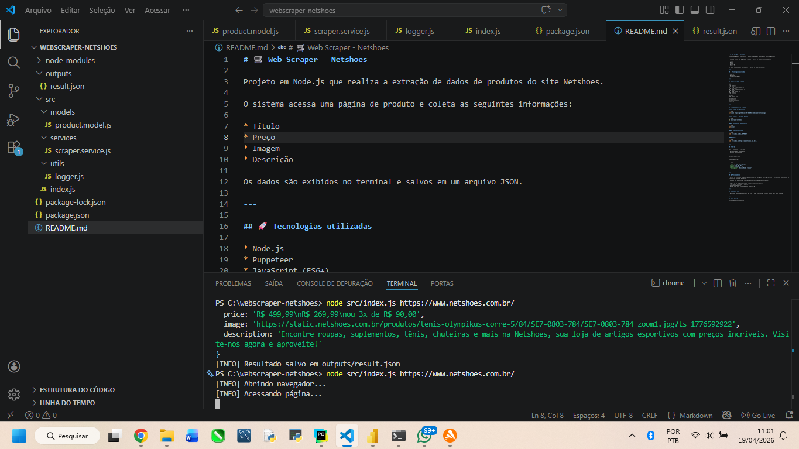
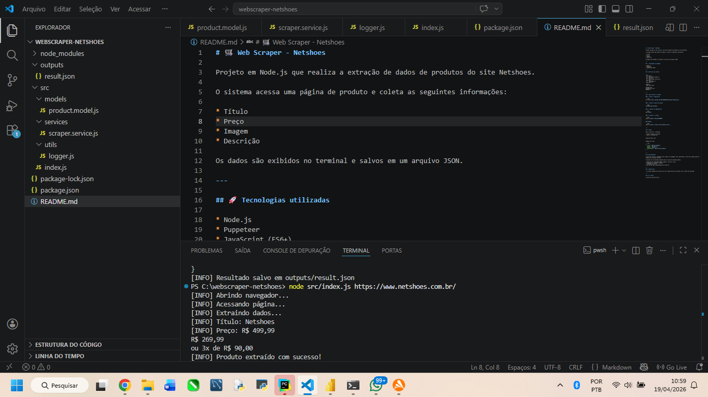

# 🛒 Web Scraper - Netshoes

Projeto em Node.js que realiza a extração de dados de produtos do site Netshoes.

O sistema acessa uma página de produto e coleta as seguintes informações:

* Título
* Preço
* Imagem
* Descrição

Os dados são exibidos no terminal e salvos em um arquivo JSON.

---

## 🚀 Tecnologias utilizadas

* Node.js
* Puppeteer
* JavaScript (ES6+)

---

## 📁 Estrutura do projeto

```
docs/
 ├── terminal.png
 └── resultado.png

outputs/
 └── result.json

src/
 ├── models/
 │    └── product.model.js
 ├── services/
 │    └── scraper.service.js
 ├── utils/
 │    └── logger.js
 └── index.js

package-lock.json
package.json
README.md
```

---

## ⚙️ Como executar o projeto

### 1. Clonar o repositório

```bash
git clone https://github.com/lucianadcorrea/webscraper-netshoes.git
```

### 2. Acessar a pasta do projeto

```bash
cd webscraper-netshoes
```

### 3. Instalar as dependências

```bash
npm install
```

### 4. Executar o scraper

```bash
node src/index.js URL_DO_PRODUTO
```

### Exemplo:

```bash
node src/index.js https://www.netshoes.com.br/...
```

---

## 📦 Saída

Após a execução, o programa:

* Exibe os dados no terminal
* Salva o resultado em:

```
outputs/result.json
```

Exemplo de saída:

```json
{
  "title": "Nome do Produto",
  "price": "R$ 199,99",
  "image": "https://...",
  "description": "Descrição do produto"
}
```

---

## 📸 Demonstração

### Execução no terminal



### Resultado gerado



---

## 🧠 Funcionamento

A aplicação utiliza o Puppeteer para simular um navegador real, garantindo a extração de dados mesmo em páginas com conteúdo dinâmico.

O projeto foi estruturado com:

* Separação de responsabilidades (models, services, utils)
* Programação orientada a objetos
* Tratamento de erros
* Uso de logs para acompanhamento da execução

---

## 📌 Observações

* O scraper depende da estrutura do site e pode precisar de ajustes caso o HTML seja alterado.

---

## 👩‍💻 Autora

Luciana de Carvalho Corrêa
